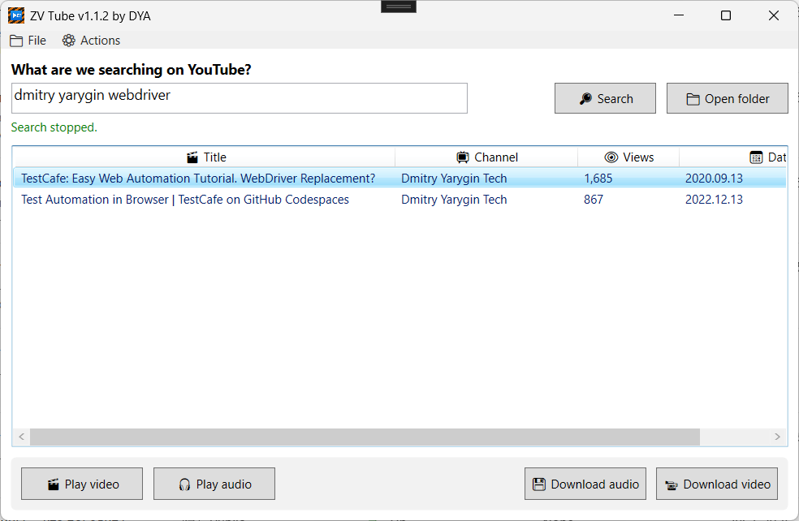

# ZV Tube

A simple WPF application for searching, downloading, and playing videos and audio from YouTube. It uses `yt-dlp` and `mpv` as external tools.



## 🚀 Features

- 🔎 Search videos by keywords (up to 30 results)
- 📥 Download video or audio only (MP3)
- ▶️ Play video or audio via `mpv`
- 📂 Open the downloads folder
- 📊 Tabular list with column sorting

## 🛠 Dependencies

### External tools
- [yt-dlp](https://github.com/yt-dlp/yt-dlp) — for fetching metadata and downloading videos
- [ffmpeg](https://ffmpeg.org/download.html) — required for conversion during downloads
- [mpv](https://mpv.io/) — for playing video and audio

**All `.exe` files must be in the same folder as the application's executable file:**

```
/ZV Player/
  ├─ yt-dlp.exe
  ├─ ffmpeg.exe
  ├─ mpv.exe
  └─ ZV Player.exe
```

### NuGet packages
The project uses standard WPF libraries. No external packages are required.

## 📁 Project structure

```
ZV Player/
├── Models/
│   └── YouTubeVideo.cs      # Data model for a YouTube video
├── Services/
│   ├── SearchService.cs     # Wrapper around yt-dlp for search
│   └── VideoService.cs      # Downloading, playback, and utilities
├── MainWindow.xaml          # XAML interface of the main window
├── MainWindow.xaml.cs       # Interaction logic and event handlers
└── README.md
```

## 🧠 How it works

1. **Search** — when a query is entered, `yt-dlp ytsearch30:"..." --print-json` is run, the results are parsed, and an `ObservableCollection` is filled.
2. **Download** — `yt-dlp` downloads the video or audio, with the path specified as `downloads/Title.%(ext)s`.
3. **Playback** — `mpv.exe` is launched with the required URL and flags.
4. **Sorting** — implemented through `CollectionView`, supported by clicking column headers.

## ⚙️ Build

Open the project in **Visual Studio** (Windows), project type — `WPF App (.NET)`.

## 📌 Notes

- Make sure that `yt-dlp`, `ffmpeg`, and `mpv` are located next to the `.exe`. They are required for the application to function.
- The downloads folder is created automatically in `./downloads/`.

---

📌 **Created with ❤️ for local use.**
⚠️ The program is intended for personal use only.
The developer is not responsible for using the application in violation of the [YouTube Terms of Service](https://www.youtube.com/t/terms), nor for any consequences related to its operation.

