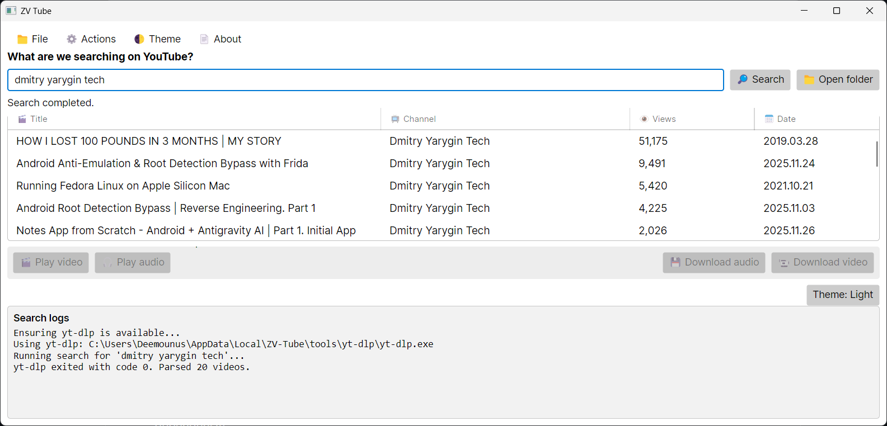

# ZV Tube (Avalonia)

Cross-platform YouTube search/downloader/player desktop app built with **Avalonia UI** and **.NET 8**, targeting Windows, Linux, and macOS.

## Prerequisites
- Required SDK: **.NET 8 SDK** for building/running from source.
- Supported OS targets: Windows, Linux, macOS.
- First run requires network access to auto-download `yt-dlp` and FFmpeg tools.
- Optional packaging dependency: `appimagetool` for Linux AppImage creation.

## Screenshot



## Features
- Search YouTube using `yt-dlp` JSON output.
- Play selected video/audio with the internally managed `ffplay` binary (downloaded with FFmpeg), with browser fallback still available.
- Download audio (`mp3`) and video (`mp4`) through `yt-dlp`.
- Light/Dark theme toggle.
- Settings persisted in the user-local folder:
  - Windows: `%LOCALAPPDATA%/ZV-Tube/settings.json`
  - Linux/macOS: local application data location via .NET `LocalApplicationData`.
- `yt-dlp` binary is auto-downloaded per platform on first use and cached in the app-local `tools` folder.
- `ffmpeg` is also auto-downloaded, cached locally, and passed to `yt-dlp` via `--ffmpeg-location` (no PATH dependency).
- Localization-ready string service abstraction.

## Quickstart (Run from source)

```bash
# Restore/build (optional)
dotnet build "ZV Player.csproj" -c Debug

# Run
dotnet run --project "ZV Player.csproj"
```

> Note: The first launch may take longer while the app downloads required `yt-dlp`/FFmpeg tools.

## Build

### Linux AppImage script
```bash
bash scripts/build-appimage.sh
```

### Windows publish script
```powershell
pwsh -File scripts/build-windows.ps1
```

## Notes
- Playback uses `ffplay` from bundled FFmpeg tools to stay cross-platform and avoid external player dependencies.
